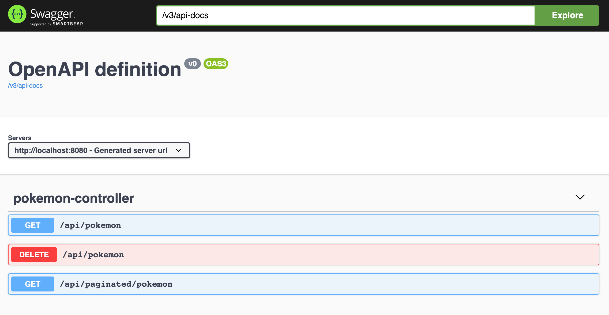

# Pokedex

Symmetry Pokemon API

The Pokedex Web Service is a data pipeline that calls the Pokemon API and stores all the pokemons into an ElasticSearch index. Redis is  used for caching for search API.

The Pokedex Web Service has been implemented using `Spring Framework` which provides dependency injection, integration with the `Elasticsearch` search engine and integrates well with Pokemon POJO model through Spring Data ElasticSearch, and abstractions of the Spring Data platform to `Redis` for data caching through Spring Data Redis.




## Prerequisites

- Java v11+
- Docker
- Docker-Compose v1.29

## Start Environment

- Open a terminal and inside Pokedex root folder run

```
  docker-compose up --build
```

- elasticsearch and redis containers are loaded first, so it takes some time when you run it for the first time.
- If you get "Compose file contains an invalid type, it should be an array" then upgrade your docker-compose.


## Application & Services URLs

`Pokedex-api` Swagger is http://localhost:8080/swagger-ui.html

`Elasticsearch` URL is http://localhost:9200

_Useful queries_
  ```
  # Check ES is up and running
  curl localhost:9200
  
  # Check indexes in ES
  curl "localhost:9200/_cat/indices?v"
  
  ```

## Future Scope 
- Unit and Integration tests needs to be added. 
- Cron job needs to be scheduled to fetch new pokemon from the pokemon API. 
- Continuous Integration needs to be added. 


